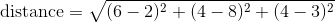

# Breast-Cancer-Classifier
Complete all of your work in `BreastCancerClassify.java`. You can test your individual methods using `BreastCancerClassifyTest.java`.
It is recommended that you do not modify `InputHandler.java`; it is responsible for reading a CSV file and creating a 2D integer array 
for you to work with in this project.

----
### Step 00 - `author` 
`author` returns a String in the format of `"Last_name, First_name"`. This will be used by the autograder. If you'd like to earn a grade in the gradebook, please do this correctly. Your name should match the name you have listed in PowerSchool.

### Step 01 - `calculateDistance` 
`calculateDistance` computes the distance between the two data parameters. The distance is found by taking the difference in each "coordinate", squaring it, adding all of those, and then taking the square root of the result. 

Remember to exclude the patient ID and the classification for each data point.

For example: 

`[12345, 6, 4, 4, MALIGNANT]`

`[22344, 2, 8, 3, BENIGN]`

The distance formula works for any number of dimensions. It is always just the square of the sum of the squared differences between 
corresponding points. 

### Step 02 - `getAllDistances`
`getAllDistances` determines the distance between a single test (one patient's data) and creates a `double` array containing the distance from this test to each point in the training set.
The `double[]` returned should have the same number of instances as `trainData`. Do not re-implement the functionality of computing distance; instead you should use the 
`calculateDistance` you just completed.  

### Step 03 - `findKClosestEntries`
`findKClosestEntries` finds and returns the indices of the K-closest points in `allDistances`. 
This method returns an array of size `K`, that is filled with the *indexes* (not the distances themselves) of the closest distances. Be careful! This function is the heart of KNN and is difficult.

### Step 04 - `classify`
`classify` makes a decision as to whether an instance of testing data is `BENIGN` or `MALIGNANT`. The function makes this decision based on the K closest train data instances (whose indexes are stored in `kClosestIndexes`).
If more than half of the closest instances are `MALIGNANT`, classify the growth as `MALIGNANT`. Otherwise the method should classify the growth as `BENIGN`. 
Return one of the global integer constants defined in this class. I.e., do not hard-code a value of `2` or `4`.  

### Step 05 - `kNearestNeighbors`
`kNearestNeighbors` classifies all the data instances in `testData` as `BENIGN` or `MALIGNANT` using the helper functions you wrote and the kNN algorithm. 
For each instance of your test data, use your helpers to find the K-closest points, and classify your result based on that!

### Step 06 - `getAccuracy`
`getAccuracy` returns a String representing the classification accuracy. 

The output String should be rounded to __two decimal places__ followed by the `%` symbol.
For example, if 4 out of 5 outcomes were correctly predicted, the returned String should be: `"80.00%"`
For example, if 3 out of 9 outcomes were correctly predicted, the returned String should be: `"33.33%"`
For example, if 6 out of 9 outcomes were correctly predicted, the returned String should be: `"66.67%"`

Read up on Java's String Formatter to learn how to round a double to two-decimal places. No fancy math is needed here. 

This method should work for any data set, assuming that the classification label is always listed in the last column of the data set.

----
A huge thanks to the AP CS+Social Good project for the inspiration of this assignment. 